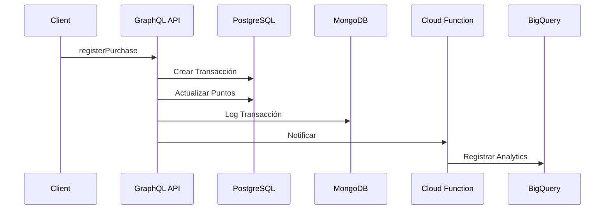
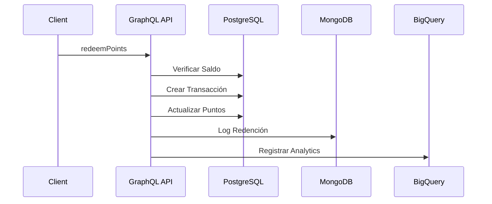

# Documentación de Arquitectura

## 📋 Índice
- [Visión General](#visión-general)
- [Componentes](#componentes)
- [Flujos de Datos](#flujos-de-datos)
- [Bases de Datos](#bases-de-datos)
- [Seguridad](#seguridad)
- [Escalabilidad](#escalabilidad)
- [Endpoints](#endpoints)

## 🏗️ Visión General

### Diagrama de Arquitectura
```
┌─────────────────┐     ┌─────────────────┐     ┌─────────────────┐
│   Cliente       │     │   API GraphQL   │     │   Cloud         │
│   (Frontend)    │────▶│   (NestJS)      │────▶│   Functions     │
└─────────────────┘     └────────┬────────┘     └─────────────────┘
                                 │
                        ┌────────┴────────┐
                        │                 │
                ┌───────▼─────┐   ┌───────▼─────┐
                │ PostgreSQL  │   │  MongoDB    │
                │ (Principal) │   │  (Logs)     │
                └─────────────┘   └─────────────┘
                        │                 │
                ┌───────▼─────┐   ┌───────▼─────┐
                │  BigQuery   │   │  Cloud      │
                │ (Analytics) │   │  Storage    │
                └─────────────┘   └─────────────┘
```

### Características Principales
- API GraphQL para operaciones CRUD
- Procesamiento asíncrono con Cloud Functions
- Almacenamiento multi-base de datos
- Sistema de logging distribuido
- Análisis de datos en tiempo real

## 🧩 Componentes

### 1. API GraphQL (NestJS)
- **Módulos**:
  - `UsersModule`: Gestión de usuarios
  - `TransactionsModule`: Gestión de transacciones
  - `RewardsModule`: Gestión de recompensas
  - `CommonModule`: Servicios compartidos

- **Servicios Principales**:
  ```typescript
  @Injectable()
  export class TransactionsService {
    constructor(
      @InjectRepository(Transaction)
      private readonly transactionRepository: Repository<Transaction>,
      private readonly usersService: UsersService,
      private readonly logger: MongoLoggerService,
      private readonly cloudFunction: CloudFunctionService,
    ) {}
  }
  ```

### 2. Cloud Functions
- **register-points**:
  ```typescript
  export const registerPoints = functions.https.onRequest(async (req, res) => {
    const { userId, points, transactionId } = req.body;
    // Lógica de registro
  });
  ```

### 3. Bases de Datos

#### PostgreSQL (Principal)
```sql
-- Esquema Principal
CREATE TABLE users (
    id UUID PRIMARY KEY,
    name VARCHAR(255),
    total_points INTEGER,
    created_at TIMESTAMP,
    updated_at TIMESTAMP
);

CREATE TABLE transactions (
    id UUID PRIMARY KEY,
    user_id UUID REFERENCES users(id),
    type transaction_type,
    points INTEGER,
    date TIMESTAMP,
    description TEXT,
    reference VARCHAR(255)
);
```

#### MongoDB (Logs)
```typescript
// Esquema de Logs
interface TransactionLog {
  userId: string;
  transactionType: 'earn' | 'redeem';
  points: number;
  status: 'success' | 'error';
  timestamp: Date;
  metadata: Record<string, any>;
}
```

#### BigQuery (Analytics)
```sql
-- Esquema de Analytics
CREATE TABLE points_system.points_transactions (
  user_id STRING,
  points INT64,
  transaction_id STRING,
  type STRING,
  timestamp TIMESTAMP,
  processed_at TIMESTAMP
);
```

## 🔄 Flujos de Datos

### 1. Registro de Compra


### 2. Redención de Puntos


## 💾 Bases de Datos

### 1. PostgreSQL
- **Propósito**: Almacenamiento principal
- **Tablas**:
  - `users`: Información de usuarios
  - `transactions`: Registro de transacciones
  - `rewards`: Catálogo de recompensas

### 2. MongoDB
- **Propósito**: Logging y eventos
- **Colecciones**:
  - `transaction_logs`: Logs de transacciones
  - `system_logs`: Logs del sistema
  - `error_logs`: Logs de errores

### 3. BigQuery
- **Propósito**: Análisis y reportes
- **Tablas**:
  - `points_transactions`: Resumen de transacciones
  - `user_metrics`: Métricas de usuarios
  - `system_metrics`: Métricas del sistema

## 🔐 Seguridad

### 1. Autenticación
```typescript
@Injectable()
export class AuthGuard implements CanActivate {
  canActivate(context: ExecutionContext): boolean {
    const request = context.switchToHttp().getRequest();
    return this.validateRequest(request);
  }
}
```

### 2. Autorización
```typescript
@Injectable()
export class RolesGuard implements CanActivate {
  canActivate(context: ExecutionContext): boolean {
    const roles = this.reflector.get<string[]>('roles', context.getHandler());
    return this.validateRoles(roles);
  }
}
```

### 3. Validación de Datos
```typescript
@InputType()
export class CreateUserInput {
  @Field()
  @IsString()
  @MinLength(3)
  name: string;
}
```

## 📈 Escalabilidad

### 1. Estrategias
- **Horizontal**: Múltiples instancias en Cloud Run
- **Vertical**: Ajuste de recursos por instancia
- **Caché**: Redis para datos frecuentes
- **CDN**: Cloud CDN para assets estáticos

### 2. Monitoreo
```yaml
# monitoring-policy.yaml
policies:
  - name: high-error-rate
    conditions:
      - display_name: "Error Rate > 1%"
        filter: 'resource.type="cloud_run_revision"'
        threshold_value: 1.0
        duration: 300s
```

## 📡 Endpoints

### GraphQL API

#### Queries
```graphql
# Consultar Puntos
query GetUserPoints($userId: ID!) {
  getUserPoints(userId: $userId) {
    id
    name
    totalPoints
  }
}

# Historial de Transacciones
query GetUserHistory($userId: ID!) {
  getUserHistory(userId: $userId) {
    id
    points
    type
    date
  }
}
```

#### Mutations
```graphql
# Registrar Compra
mutation RegisterPurchase($userId: ID!, $amount: Float!) {
  registerPurchase(userId: $userId, amount: $amount) {
    id
    points
    type
  }
}

# Redimir Puntos
mutation RedeemPoints($userId: ID!, $rewardId: ID!) {
  redeemPoints(userId: $userId, rewardId: $rewardId) {
    id
    points
    type
  }
}
```

### Cloud Functions

#### Registrar Puntos
```http
POST https://your-region-your-project.cloudfunctions.net/register-points
Content-Type: application/json

{
  "userId": "user-uuid",
  "points": 100,
  "transactionId": "transaction-uuid"
}
```

### Logs y Monitoreo

#### MongoDB Logs
```typescript
// Estructura de Logs
interface SystemLog {
  level: 'info' | 'warn' | 'error';
  message: string;
  component: string;
  timestamp: Date;
  metadata: Record<string, any>;
}
```

#### BigQuery Analytics
```sql
-- Consulta de Métricas
SELECT 
  DATE(timestamp) as date,
  COUNT(*) as total_transactions,
  SUM(points) as total_points,
  COUNT(DISTINCT user_id) as unique_users
FROM `points_system.points_transactions`
GROUP BY date
ORDER BY date DESC
LIMIT 30;
```

## 🔄 Ciclo de Vida de los Datos

### 1. Transacciones
1. **Creación**:
   - Validación de datos
   - Registro en PostgreSQL
   - Log en MongoDB
   - Notificación a Cloud Function

2. **Procesamiento**:
   - Actualización de puntos
   - Registro en BigQuery
   - Notificaciones (si aplica)

3. **Retención**:
   - PostgreSQL: 2 años
   - MongoDB: 1 año
   - BigQuery: Indefinido

### 2. Logs
1. **Generación**:
   - Logs de aplicación
   - Logs de sistema
   - Logs de errores

2. **Almacenamiento**:
   - MongoDB: 30 días
   - BigQuery: Indefinido
   - Cloud Logging: 30 días

## 🛠️ Herramientas de Desarrollo

### 1. Local
- Docker Compose
- PostgreSQL local
- MongoDB local
- Firebase Emulator

### 2. Producción
- Google Cloud Run
- Cloud SQL
- MongoDB Atlas
- BigQuery
- Cloud Functions 